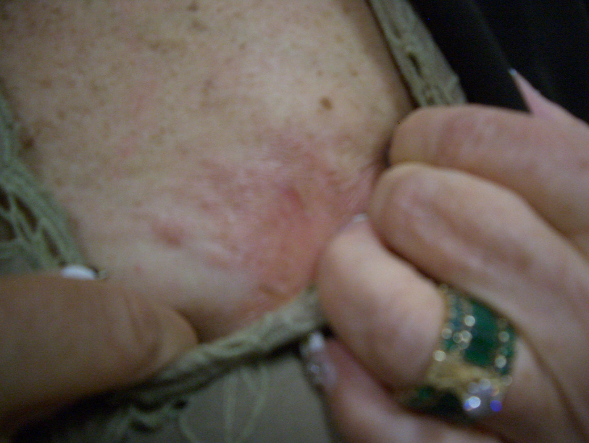

治疗一年以上的末期乳癌病人

09/09/2008 今天那位二年前就被美国西医告知得到末期乳癌的患者来诊，她服用中药已经有一年以上，从开始至今，她的体重一共少了 65 磅，我今天再提到她的原因是，她要我看看她原本已经溃烂的左乳房，她拉开衣服后，左乳上原本溃烂的皮肤，已经长出新皮了，而且是鲜嫩的红色皮肤，像婴儿皮肤一样，真是很让我很替她高兴，我相信在场所有的跟诊医师看到这一幕后，除了惊喜于中药的神奇外，都会替她的重生而高兴，由于她对中医药的信心，加上她从未被西医开过刀，从没有做过化疗，所以才有今天的好结果出现。

简单的陈述一下这过去的一年来，她身体的变化给读者听 :

第一 : 她原本已经有四年停止来潮的月经，经服用中药后，月经居然每个月都准时来，而且量很大，每来一次，她就感到乳房中的硬块在缩小中。

第二 : 她每天都保持很开心的心情，随时都在跟周围的人开玩笑，脚上长年穿着珠珠鞋，人还没进诊疗室，就先听到她开心的笑声。

第三 : 由于她的心脏功能被中药调理好了，所以体重直线下降，这让她更开心，于是进入良性循环。

第四 : 她母亲得到乳癌有 38 年了，一直都很好，她母亲告诉她，只要不给西医碰，乳癌就不会让妳丧命，她深信这金玉良言，而且奉行不悔。

第五 : 持续不断的接受中药的治疗，这一年多来她从未间断过吃中药，无论我开难喝的汤剂给她，还是开丸剂给她，她都照单接受，毫无疑问跟怨言。从开始治疗到今天，她从未问过我一句话，就是中药要吃多久? 这种蠢问题，一旦病人问出这种问题，就表示对中药已经失去信心。

第六 : 不知她是从何得知我要去西藏，每次来诊时都不忘提醒我，一定要带她一起去西藏，我每次都开玩笑的告诉她，我不要带一位胖女人又有乳癌的去西藏玩，除非妳再瘦 50 磅，我就带妳去，她可能是因为心中有这个愿望，所以一直加强磨练自己，逼自己多运动，不吃牛奶制品，所以活的很开心又有希望啊。

我想任何的乳癌末期患者，如果都能像她一样，无惧于乳癌的侵蚀，不要再去找西医治疗了，随时随地都想着光明的一面，对人生充满信心，就有希望能够痊愈，千万不可以丧失求生的意志，这方面是没有药可以治疗的。

我是要前往西藏一游的，原本想法是自己独自一人前往，可是想想可能我的学生中，有许多人也希望能跟我同行这一生难得的一趟旅游，旅途一路上无聊时，还可以听我讲述些真实难治医案治疗时我的心历过程与处方变化，所以这西藏之旅，我考虑开放给同学们，有兴趣跟老师一同前往的学生，可以跟雅晴报名，由于我必须隐藏行踪，所以非常低调，如果没有让报名参加的同学一起去，并不是老师不愿意让你们跟，而是人数不能超过太多，过于招摇会引人注目，所以人数是有限制的， 希望大家都能了解这一点。

汉唐中医 倪海厦谨记于佛州 09/09/2008

这张照片就是拍自上篇中这位末期乳癌病患的伤口，从原先溃烂的表皮，到现在收敛的伤口已经出现粉红色正常的结疤， 而且她从发病至今有二年了，期间从未感觉到任何的疼痛，此人之所以可以恢复过来，就是因为她从头到尾都不接受任何西医的切片与开刀还有化疗，妳在西医院中是无法看到这种珍贵的照片，因为从未有乳癌病人的伤口恢复过来 过。

如果在中医治疗之前先给西医动过，就很难有机会再恢复到正常了。尤其是经过西医开刀切除乳房后的伤口将更坏，这种伤口会痛澈心肺，连止痛药都无法止痛 ，止痛药的副作用就是肝癌，而西医对此种副作用不加说明，却以乳癌移转成肝癌为理由，一口蒙骗过病人与其家属们，而且溃烂的伤口无法收口，恶臭难当持续的在发炎，其照片就是下面这张了。妇女们看完这两张照片后，请自己做一个比较，如果那天妳得到乳癌时，明智的妳们应该可以自己做选择 了，妳看是要找中医治疗乳癌呢?还是要找西医治疗乳癌呢? 我将这乳癌真实案例向读者说明的唯一目的，就是想救天下的妇女们，不要继续被西医欺骗了，也不要因为我的案例说明而来找我看病，请就近找妳们知道的中医师来治疗乳癌，祝福大家都能脱离乳癌的威胁。

许多读者来传真，希望我来解决你们的问题，请勿抱希望,因为我是无法回答你们的问题，我这里是个学术网站，不是医疗咨询网站，读者有疾病的问题时，请就近找中医师来协助你们，我实在无能为力去猜测你们遇到什么问题，所以请千万不要传真来问你们个人的问题，以免耽误你们的病情，目前我是一律不做回答的，请勿再试，请见谅。