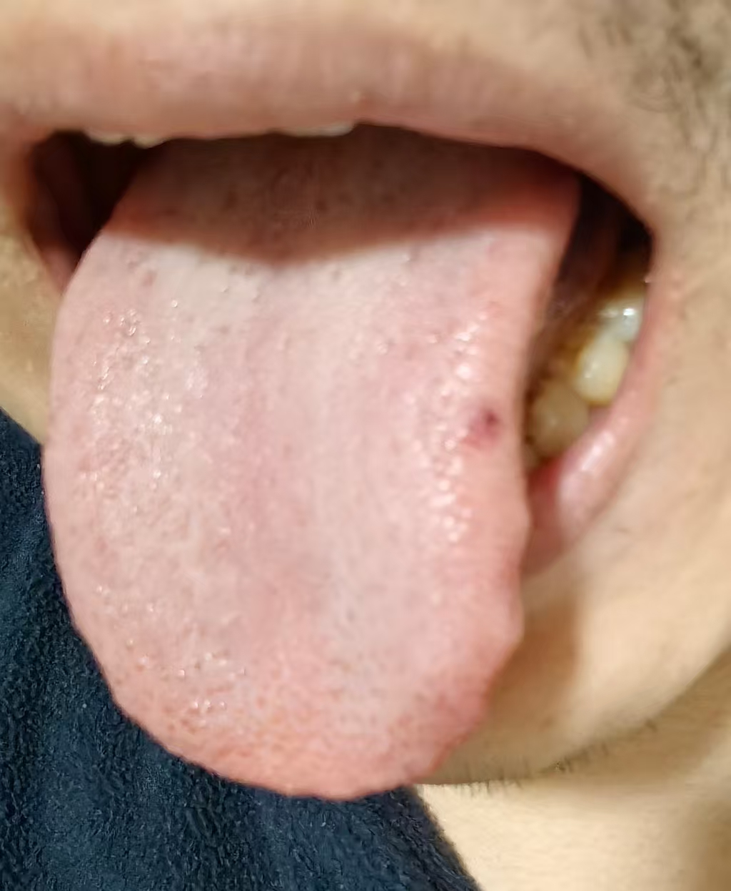

#### 症状

喝了羊肉汤，辣椒也辣，嗓子不得劲，又有点痰了，吸气也不顺，感觉喉咙眼燥燥痒痒的，不过没咳嗽。吃完当时眼睛周围出汗，蒸汽会遮住眼镜片，其他地方不出汗。

下巴尤其是两侧地仓处，发红、干、微燥痒，抹了点紫草膏会缓解

右上腹肋骨处开始隐隐轻微胀痛，睡眠也多梦严重，舌本燥，善太息。舌两侧碰到牙齿会微痛。

舌头左侧舌苔下面的舌质上出现红点，之前出过一次，过两天自己好了，没在意。

舌苔微黄，晨起时黄暗加重且微腻，舌前裂纹很明显。晨起后出现一次左肋轻微胀痛。

#### 分析

治肾，如果也按泻南补北的思路，补肺，泻肝

正好火气上逆，麦门冬汤，吸气不顺有半夏。糯米就不加了，放到每天的粥里。天门冬便宜，少用点麦门冬。

肝中风者，头目润，两胁痛，行常伛，两臂不举，舌本燥，善太息，令人嗜甘。

眼眶出汗蒸汽，算头目润？或者是头目润动，几个月前倒是有眼眶跳动，没有治好，自己好的，当时应该加点钩藤了。

太阳中风会有汗，眼眶这里有风，可能也会造成局部汗蒸汽。

有两胁痛。舌本燥，有一点。善太息，有。

有胁痛果断用柴胡剂。

去掉续断、山茱萸，小柴胡汤，用竹叶柴胡试试，剂量大一点

橘枳生姜汤再加竹茹，温胆汤

试试淫羊藿效果，2克都一小堆了，很蓬松不占重量。

#### 处方

巴戟天8克 炮附子8克 覆盆子8克 补骨脂8克 生地黄12克 淫羊藿2克

天门冬12克 麦门冬12克 

竹茹12克 枳壳16克 陈皮16克 

竹叶柴胡30克 黄芩8克 甘草8克 半夏12克 北沙参8克 大枣6枚 生姜5片 

9碗水煮3碗，一天三次，饭前

#### 总结

晚上舌苔不黄腻了，舌侧红点变淡且缩小一点，舌前裂纹也缩小了。

善太息还有，5号，应增加黄芩到12克清热，甘草北沙参也等量加到12克，加郁金16克增强疏肝。

感觉竹叶柴胡没有什么感觉，还是用北柴胡12克，根更入藏。

6号舌侧红点就没了。