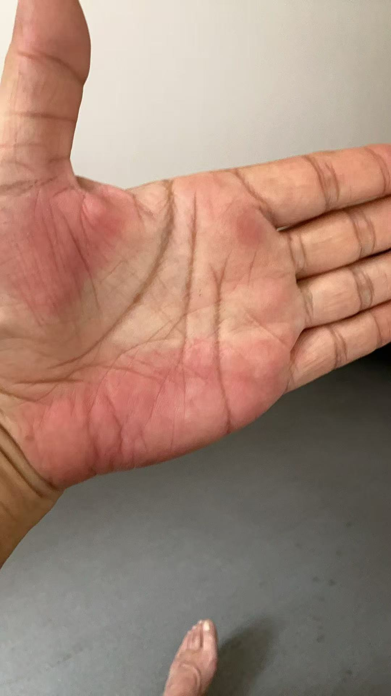
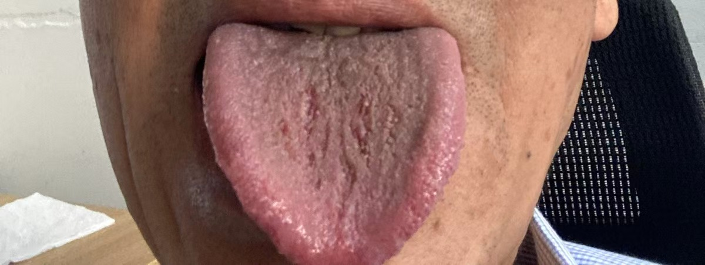

#### 症状

男，手掌大小鱼际发红，像是肝掌，但是去医院大夫说不是，肝掌更红，同时身上会有蜘蛛志。

便秘，一运动容易四五天拉不出来，但是不难受。

头的两侧长了几个黄豆大小的痘，里面有浆水，在胆经与膀胱经交界处偏胆经一些。

爱喝酒，无法戒酒。

切除过一个甲状腺，每天一片优甲乐，曾经得过乙肝。

体力很好，能做100个俯卧撑。

饭量正常，也不是必须喝酒才有胃口吃饭。

脾气正常，不易发怒。

舌苔黄腻，暗淡无光，看起来没什么津液，舌中小裂纹多，舌头两侧发红有齿痕。看起来像倪师说的舌苔翘起来了？

#### 思路

原先想着倪师的清肝四宝，柴胡黄芩郁金龙胆草，加治肝先治脾，白术茯苓，加个小承气。但是病人不懂剂量，就推荐了大柴胡汤，大柴胡里，柴胡黄芩清肝，加上郁金龙胆草感觉更好，白芍柔肝还能健脾，半夏我拿不准，如果口渴可以不用，也算是健脾。剩下就是治便秘了。

本来想着急下存阴，但是又想起病人爱喝酒，算是酒客不能攻下，最后一问，大便几天不出来并不难受，也不用攻下了。先用小柴胡汤加润肠的药。

便秘好了之后再看，如果是肝寒，可以用吴茱萸汤试试。

#### 处方

柴胡四钱 | 半夏三钱 | 黄芩、人参、甘草、生姜二钱 | 大枣十二枚劈 | 当归三钱 | 柏子仁三钱 | 麻子仁三钱 | 郁金四钱 

#### 总结

先去医院看中医，医生看了舌头说脾胃不好，病人自述有过乙肝，开了查肝的血检，等第二天出检查结果再开药。